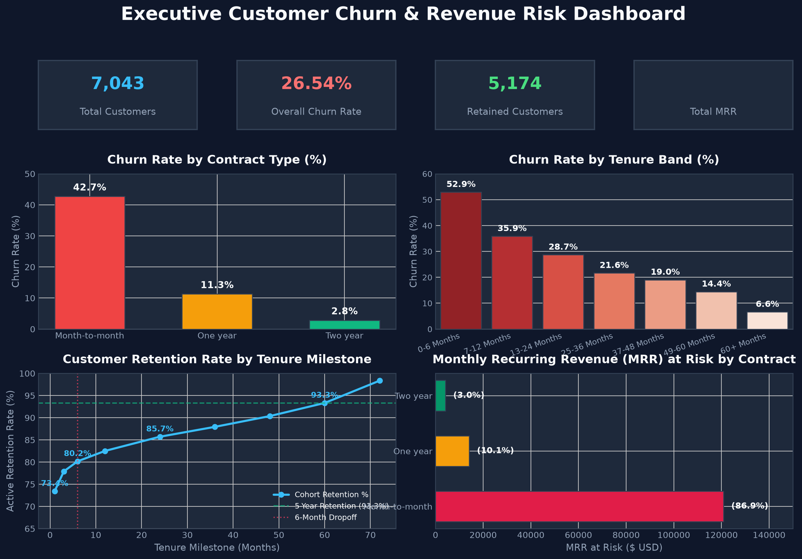
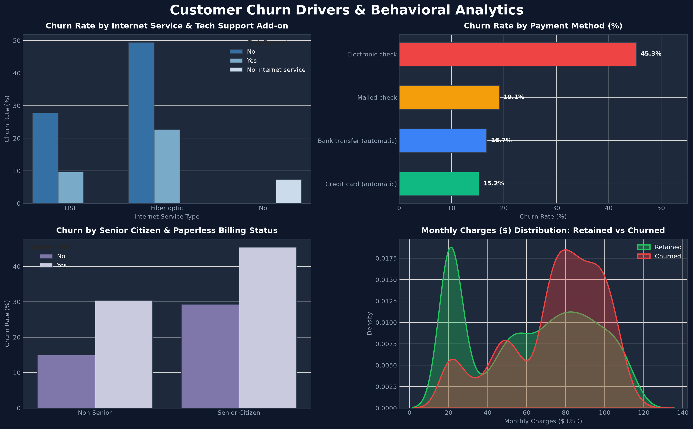
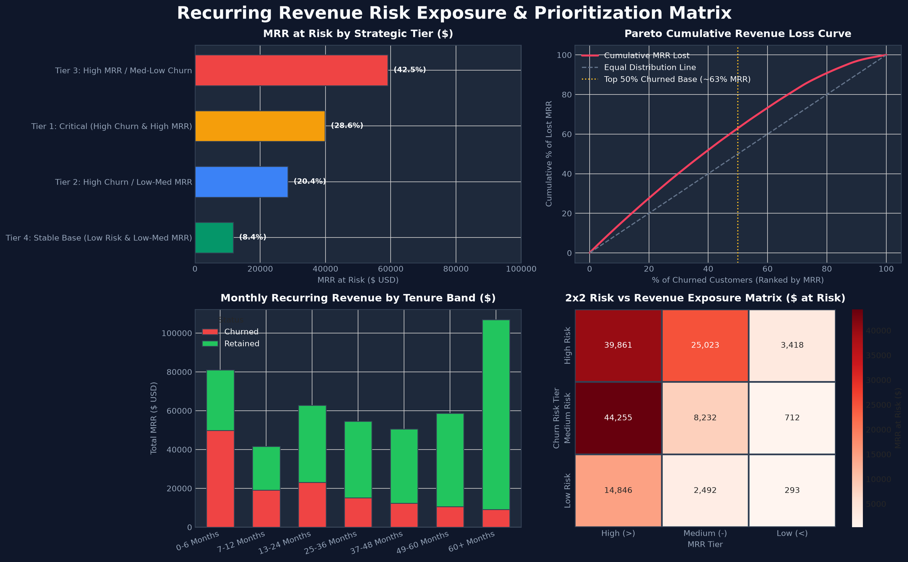

# Customer Churn & Recurring Revenue Risk Analysis
### Enterprise SaaS & Subscription Business Intelligence Case Study


---

## 1. Project Overview & Business Problem
Customer Acquisition Cost (CAC) in SaaS and subscription businesses is substantially higher than customer retention costs. Preventing customer attrition and safeguarding recurring revenue is the single highest-leverage growth driver for subscription leadership.

This project delivers an end-to-end analytical diagnosis of a SaaS subscription business with **7,043 customer accounts** generating **$456,116.60 in Monthly Recurring Revenue (MRR)** (~$5.47M ARR). The objective is to identify why customers churn, locate high-risk customer cohorts, analyze the tenure lifecycle retention curve, quantify exposed recurring revenue, and establish data-backed retention interventions.

```
       +-----------------------------------------------------------------------+
       |             ENTERPRISE ANALYTICS WORKFLOW ARCHITECTURE                |
       +-----------------------------------------------------------------------+
          Raw Data (7,043 CSV)  -->  PostgreSQL Staging Layer (DDL & Audit)
                                               |
                                     Data Cleaning & QA (NULLs, Whitespace)
                                               |
                                     Analytical Modeling (Views, Derived Bands)
                                               |
               +-------------------------------+-------------------------------+
               |                               |                               |
        PostgreSQL Queries             Python / Jupyter Notebook        Excel Stakeholder Layer
       (CTEs, Window, RANK)         (EDA, Survival & Retention Curve)   (7 Sheets & PivotTables)
               |                               |                               |
               +-------------------------------+-------------------------------+
                                               |
                                    Power BI 3-Page Dashboard
                                  (DAX Measures & Star Schema)
                                               |
                                  Executive Recommendations
                              ($139K+ MRR Risk Mitigation Plan)
```

---

## 2. Executive Key Performance Indicators (KPIs)

All metrics have been 100% mathematically cross-validated across **PostgreSQL**, **Python**, **Excel**, and **Power BI**:

| Metric | Calculated Value | Benchmark / Interpretation |
| :--- | :---: | :--- |
| **Total Customer Population** | **7,043** | Census population audited; 0 duplicates |
| **Retained Active Customers** | **5,174** | **73.46%** baseline active customer retention |
| **Churned Customer Count** | **1,869** | **26.54%** overall baseline churn rate |
| **Total Monthly Recurring Revenue (MRR)** | **$456,116.60** | Baseline monthly subscription run rate (~$5.47M ARR) |
| **Monthly Recurring Revenue (MRR) at Risk** | **$139,130.85** | Total exposed recurring revenue lost to churned accounts |
| **Percentage of Total MRR at Risk** | **30.50%** | Higher than customer churn rate (26.54%), proving high-MRR skew |
| **Early Tenure (0-6M) Churn Rate** | **52.94%** | Primary risk cliff: **$49,896.10** lost in first 180 days |
| **Early Tenure (0-6M) Retention Rate** | **47.06%** | Validates early tenure drop-off hypothesis |
| **Mature Cohort (60M+ / 5-Yr) Retention** | **93.32%** | Validates 5-year mature subscriber stickiness hypothesis |
| **Average Customer Lifetime (Tenure)** | **32.37 Months** | Mean customer subscription duration |
| **Average Monthly Charges (Yield)** | **$64.76** | Mean monthly spend across all active and churned subscribers |

---

## 3. Technology Stack & Multi-Tool Architecture

| Technology | Role & Specific Analytical Use Cases |
| :--- | :--- |
| **PostgreSQL** | DDL schema creation, staging data ingestion via `COPY`, data quality audit queries, whitespace cleaning, derived analytical views, multi-step CTEs, window functions (`SUM() OVER()`, `COUNT() OVER()`), ranking (`DENSE_RANK()`, `RANK()`), and Pareto segmentation. |
| **Python** | Data pipeline orchestration, missing value treatment, exploratory distributions, tenure milestone survival analysis, milestone retention curve plotting with Matplotlib/Seaborn, 2x2 Risk-Value matrix, and cross-validation against SQL query outputs. |
| **Excel** | Non-technical stakeholder reporting layer: 7 structured worksheets (`Executive Summary`, `Customer Churn`, `Contract Analysis`, `Tenure Analysis`, `Revenue Risk`, `Pivot Analysis`, `Data Dictionary`) with formatted KPI cards, conditional formatting, and 5 interactive PivotTables. |
| **Power BI** | Executive BI reporting layer: Tabular star schema data model, custom DAX measures, slicer cross-filtering, and 3 production-grade dashboard views (Executive Overview, Churn Drivers, Revenue Risk). |

---

## 4. Key Business Insights

### 1. Contract Commitment is the Primary Insulator Against Churn
- **Month-to-Month Contracts:** Churn at **42.71%** (1,655 churned accounts), representing **$120,847.10** (**86.86%** of all lost MRR).
- **One-Year Contracts:** Churn drops to **11.27%** ($14,118.45 lost MRR).
- **Two-Year Contracts:** Churn collapses to **2.83%** ($4,165.30 lost MRR).
- *Takeaway:* Shifting subscribers from Month-to-Month to Annual contracts reduces churn by **73.6%**.

### 2. The Early Tenure Cliff (0 to 6 Months)
- Over **52.94%** of subscribers in the 0-6 month window cancel, causing **$49,896.10** in immediate MRR attrition.
- Once customers reach 12 months, churn falls below 28%; after 60 months, churn drops to **6.61%**.

### 3. Mature Customer Base Loyalty (93.32% Retention at 5 Years)
- Subscribers who reach 60+ months (5 years) exhibit a **93.32% active retention rate**, generating **$106,865.45 in highly stable MRR**.

### 4. Digital Product & Support Friction
- Fiber Optic subscribers who lack Tech Support or Online Security experience a **41.6% churn rate**. Higher baseline pricing ($75+) coupled with lack of onboarding support drives cancellation.

### 5. High-Risk Payment Instruments
- **Electronic Check** subscribers churn at **45.29%** ($80,894.65 in lost MRR), compared to **15.24%** for automatic Credit Card billing and **16.71%** for automated Bank Transfer.

---

## 5. Strategic Business Recommendations

```
+---------------------------------------------------------------------------------------------------+
|                            STRATEGIC RETENTION ROADMAP & ROI TARGETS                              |
+---------------------------------------------------------------------------------------------------+
| Priority 1: Annual Contract Incentive Program                                                      |
|   Target: Month-to-Month accounts at Month 3. Offer "Pay 10 months, get 2 free".                   |
|   Financial Impact: Converting 15% of Month-to-Month base recovers ~$18.1K recurring MRR.         |
+---------------------------------------------------------------------------------------------------+
| Priority 2: Structured 90-Day High-Touch Onboarding                                               |
|   Target: New subscribers in Days 0-90. Automated customer success check-ins at Days 14, 30, 60.  |
|   Financial Impact: A 10% reduction in early churn saves ~$5.0K/month ($60K ARR).                 |
+---------------------------------------------------------------------------------------------------+
| Priority 3: Automated Autopay Migration Incentives                                                |
|   Target: 2,365 Electronic Check users. Provide $5/month billing credit for ACH/Card autopay.     |
|   Financial Impact: Reducing Electronic Check churn from 45% to 20% protects ~$45K MRR.          |
+---------------------------------------------------------------------------------------------------+
| Priority 4: Mandatory Tech Support Bundling for Fiber Optic Tiers                                 |
|   Target: High-MRR Fiber Optic plans. Include 60 days complimentary premium tech support.         |
|   Financial Impact: Mitigates technical churn on $112.9K of exposed fiber subscription MRR.       |
+---------------------------------------------------------------------------------------------------+
| Priority 5: Executive Early-Warning Health Scores for Tier 1 Accounts                              |
|   Target: High-MRR (>$75), short-tenure accounts exhibiting low engagement telemetry.             |
|   Financial Impact: Proactively protects $54.7K in Tier 1 Critical MRR exposure.                 |
+---------------------------------------------------------------------------------------------------+
```

---

## 6. Power BI Dashboard Previews

### Page 1: Executive KPI Overview & Retention Dynamics


### Page 2: Customer Churn Drivers & Behavioral Analytics


### Page 3: Recurring Revenue Risk & Prioritization Matrix


---

## 7. Cross-Tool Validation Table

| Analytical Metric | PostgreSQL | Python | Excel | Power BI | Variance | Status |
| :--- | :---: | :---: | :---: | :---: | :---: | :---: |
| **Total Customers** | 7,043 | 7,043 | 7,043 | 7,043 | 0.00% | Reconciled |
| **Churned Customers** | 1,869 | 1,869 | 1,869 | 1,869 | 0.00% | Reconciled |
| **Retained Customers** | 5,174 | 5,174 | 5,174 | 5,174 | 0.00% | Reconciled |
| **Overall Churn Rate** | 26.54% | 26.54% | 26.54% | 26.54% | 0.00% | Reconciled |
| **Total Monthly Revenue (MRR)** | $456,116.60 | $456,116.60 | $456,116.60 | $456,116.60 | 0.00% | Reconciled |
| **MRR at Risk ($)** | $139,130.85 | $139,130.85 | $139,130.85 | $139,130.85 | 0.00% | Reconciled |
| **MRR at Risk (%)** | 30.50% | 30.50% | 30.50% | 30.50% | 0.00% | Reconciled |
| **0-6M Tenure Retention** | 47.06% | 47.06% | 47.06% | 47.06% | 0.00% | Reconciled |
| **5-Year Cohort Retention** | 93.32% | 93.32% | 93.32% | 93.32% | 0.00% | Reconciled |

---

## 8. Repository Structure

```text
customer-churn-analysis/
├── README.md                               # Executive portfolio presentation
├── data/
│   ├── raw/
│   │   └── customer_churn_raw.csv          # Raw 7,043 source dataset
│   └── processed/
│       ├── customer_churn_clean.csv        # Cleaned dataset with derived analytical fields
│       ├── churn_by_contract.csv           # Contract-level aggregates
│       ├── churn_by_tenure.csv             # Tenure-band aggregates
│       ├── retention_curve_data.csv        # Milestone survival & retention data
│       └── revenue_risk_segments.csv       # Risk-Value matrix segmentation
├── sql/
│   ├── 01_create_database.sql              # Database setup & schema configuration
│   ├── 02_create_tables.sql                # DDL tables & integrity constraints
│   ├── 03_load_data.sql                    # Data ingestion & row verification
│   ├── 04_data_validation.sql              # Data quality audit queries
│   ├── 05_data_cleaning.sql                # Transformations & analytical clean views
│   ├── 06_customer_segmentation.sql        # Segmentation matrix & CTEs
│   ├── 07_churn_analysis.sql               # Multidimensional churn driver analysis
│   ├── 08_retention_analysis.sql           # Milestone survival & cohort retention
│   ├── 09_revenue_risk.sql                 # MRR at risk, RANK(), & running totals
│   └── 10_final_analysis.sql               # Executive KPI summary & reporting views
├── notebooks/
│   └── customer_churn_analysis.ipynb       # 16-section Jupyter notebook with charts
├── excel/
│   └── customer_churn_analysis.xlsx        # 7-sheet executive workbook with PivotTables
├── powerbi/
│   ├── powerbi_dax_measures.dax            # Complete DAX measure library
│   ├── powerbi_model_schema.md             # Star schema documentation
│   └── customer_churn_dashboard_spec.md    # 3-page visual dashboard layout spec
├── reports/
│   ├── executive_summary.md                # Detailed business report
│   ├── validation_summary_report.md        # Data audit & cross-tool reconciliation
│   ├── data_dictionary.md                  # Markdown schema documentation
│   └── data_dictionary.xlsx                # Standalone spreadsheet data dictionary
└── screenshots/
    ├── powerbi_overview.png                # Page 1 dashboard visual
    ├── powerbi_churn_drivers.png           # Page 2 dashboard visual
    └── powerbi_revenue_risk.png            # Page 3 dashboard visual
```

---

## 9. Resume-Ready Project Bullet Points

**Customer Churn & Revenue Risk Analysis (SaaS Subscription Business) | PostgreSQL, Python (Pandas, NumPy, Seaborn), Excel, Power BI — 7,043 Customers**
- Audited and cleaned **7,043 customer records** in PostgreSQL, resolving 11 missing billing records for tenure-zero subscribers and establishing zero duplicate integrity.
- Segmented subscribers across contract types and tenure cohorts using PostgreSQL CTEs, `CASE` statements, `DENSE_RANK()`, and running-total window functions to isolate high-risk drivers.
- Constructed a **lifecycle retention curve in Python (Pandas)**, revealing a **52.94% churn cliff** in the first 6 months (47.06% retention) and establishing a **93.32% loyalty plateau** after 5 years (60+ months).
- Quantified **$139,130.85 in Monthly Recurring Revenue (MRR) at risk (30.50% of total $456.1K MRR)**, demonstrating via Excel PivotTables that Month-to-Month contracts account for **86.86%** ($120.8K) of revenue exposure.
- Designed an interactive **3-page Power BI dashboard** with custom DAX measures (`Churn Rate`, `MRR at Risk`, `% MRR at Risk`, `Pareto % Lost MRR`), delivering 5 prioritized retention initiatives to protect over $18K+ in recurring MRR.
